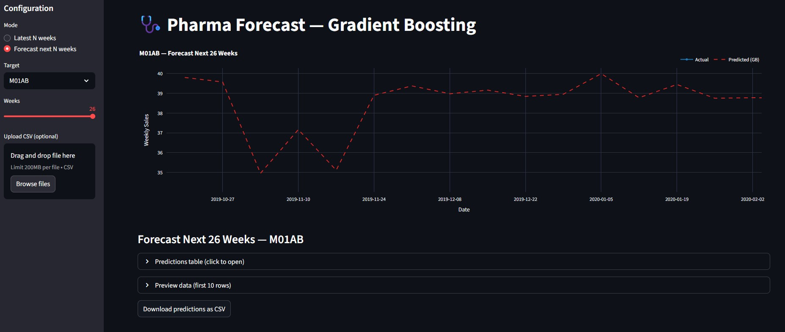

# Pharma-Forecast: Weekly Pharmaceutical Sales Forecasting (Gradient Boosting)

A robust forecasting tool designed to predict weekly sales for key pharmaceutical product groups (ATC categories `N02BE` and `M01AB`). This project leverages Gradient Boosting models to generate accurate predictions and exposes them through an interactive Streamlit web application for business users.

## Overview

The primary goal of this project is to provide reliable sales forecasts that empower stakeholders—such as supply chain managers, financial analysts, and marketing teams—to make data-driven decisions. By predicting future demand, businesses can optimize inventory levels, improve financial planning, and strategize marketing campaigns more effectively. The application offers two main functionalities:

1. **Historical Prediction Analysis:** Evaluate model performance by comparing predictions against actual sales for the most recent weeks.
2. **Future Forecasting:** Generate sales forecasts for upcoming weeks where actual data is not yet available.

## Business Value & Problem Statement

In the pharmaceutical industry, managing sales and inventory for specific drug categories is a significant operational challenge. Sales volumes can be volatile, influenced by seasonality, competitor actions, and broader public health trends. Inaccurate forecasting leads to two critical business problems:

* **Overstocking:** Ties up capital in unsold inventory, increases storage costs, and risks financial loss from expired products.
* **Understocking:** Results in missed sales opportunities, potential loss of market share, and can impact patient access to necessary medications.

This project directly addresses these challenges by providing a reliable, data-driven forecasting tool. By leveraging historical sales data and relevant features (such as lag and calendar variables), our Gradient Boosting models deliver accurate weekly sales predictions for key ATC categories (`N02BE` and `M01AB`).

The key business outcomes include:

**Optimized Inventory Control:** Maintain optimal stock levels to prevent both stockouts and costly overstock situations
**Enhanced Financial Planning:** Generate more accurate revenue projections for better budgeting and resource allocation.
**Informed Marketing Strategy:** Empower marketing teams to measure campaign impact and plan future initiatives based on robust demand forecasts.
**Improved Supply Chain Efficiency:** Enable proactive adjustments in procurement and distribution based on predicted demand shifts.

## Live Application Preview

**[➡️ Access the Live Application Here](https://kaganmart9-pharma-forecast.streamlit.app/)**

The final output of this project is an interactive Streamlit web application that allows business users to explore historical predictions and generate future forecasts without writing any code.

* **Left Sidebar:** Users can configure the forecast by selecting the target product (ATC category), the operational mode (`Latest N weeks` vs. `Forecast next N weeks`), and the number of weeks for the analysis. They can also upload their own data for on-the-fly predictions.
* **Main Panel:** Displays an interactive Plotly chart visualizing the actual vs. predicted sales. Below the chart, users can inspect the raw prediction data in a table and download it as a CSV file for offline analysis.

Here are some screenshots of the application:

**1. Historical Prediction Analysis View**
*(This view allows users to compare the model's predictions against actual sales data for the most recent weeks.)*


**2. Future Forecasting View**
*(This view generates sales forecasts for upcoming weeks where no actual data is available.)*


## Project Structure

The repository is organized to separate concerns, making it easy to navigate, maintain, and extend. Key directories and files are explained below.

```diff
+ pharma-forecasting/                  (Main Project Directory)
+ ├── data/                
+ │   ├── processed/           
+ │   ├── raw/
+ │   
+ ├── models/                          
+ │   └── gb_M01AB.pkl
+ │   └── gb_N02BE.pkl
+ │   
+ ├── notebooks/
+ │    └── 00_check_date_column.ipynb
+ |    └── 01_data_cleaning.ipynb
+ |    └── 02_eda.ipynb
+ |    └── 03_feature_engineering.ipynb
+ |    └── 04_modeling_forecasting.ipynb
+ |    └── 05_model_evaluation_diagnostics.ipynb
+ |    └── 06_feature_importance_explainability.ipynb
+ |    └── 07_model_optimization.ipynb
+ |    └── 08_model_evaluation_final.ipynb
+ |    └── 09_model_comparison_final_selection.ipynb
+ |    └── 10_diagnostics_interpretability.ipynb
+ |    
+ |─── results/
+ |    ├── comparisons/
+ |    ├── errors/
+ |    ├── figures/
+ |    ├── final/
+ |    ├── importance/
+ |    ├── optimization/
+ |
+ ├── scripts/                 
+ │   ├── predict_latest.py
+ │   └── train_and_export.py
+ │       
+ ├── app.py
+ ├── README.md
+ ├── requirements.txt
+ │      
+ ├── .gitignore

```

**Key Components:**

* **`app.py`**: The entry point for the Streamlit interactive application. It handles the UI, loads models, and orchestrates the prediction and visualization logic.
* **`scripts/`**: Contains standalone Python scripts for core ML tasks.
  * `train_and_export.py`: This script loads the processed data, performs a time-series split, trains a Gradient Boosting model for each target, and saves the serialized models to the `models/` directory.
  * `predict_latest.py`: A command-line utility to load a model and generate predictions for the most recent data points, saving the output to the `results/` directory.
* **`models/`**: Stores the final, trained model artifacts (`.pkl` files). Keeping models separate from code allows them to be updated independently.
* **`data/`**: Contains the datasets used in the project. The `processed` subdirectory holds the feature-engineered data ready for model training.
* **`results/`**: A directory for storing outputs like model performance metrics and prediction CSVs.

## Technical Workflow & Modeling

This project follows a standard machine learning workflow for time-series forecasting, from data preparation to model deployment.

### 1. Data Preparation & Feature Engineering

The process begins with a raw sales dataset, which is cleaned and transformed to create a feature-rich dataset suitable for modeling.

* **Data Source:** The core data consists of weekly sales figures for pharmaceutical products, identified by their ATC codes.

* **Feature Creation:** To capture the time-dependent nature of sales, we engineer several critical features:

* **Lag Features:** Past sales values (e.g., sales from 1, 2, 3, 4, 8, and 12 weeks ago) are included as features. These are crucial for autoregressive models as they capture recent trends and momentum.

* **Calendar Features:** Time-based features like `weekofyear`, `month`, and `year` are extracted from the date. This allows the model to learn seasonal patterns (e.g., higher sales during flu season) and long-term trends.
  
* **Data Cleaning:** The final dataset (`pharma_sales_features_v2_clean.csv`) is cleaned of missing values and inconsistencies to ensure model stability and reliability.

### 2. Model Training & Selection

* **Model Choice:** A **Gradient Boosting Regressor** (`sklearn.ensemble.GradientBoostingRegressor`) is used as the core forecasting model. This model was chosen for its high performance, robustness to outliers, and its ability to capture complex, non-linear relationships between the engineered features and weekly sales.
* **Training Strategy:**
  * **Time-Series Split:** To accurately simulate a real-world forecasting scenario, the data is split chronologically. The model is trained on data up to a specific cutoff date (`2018-09-16`) and evaluated on a subsequent, unseen period (from `2018-09-23` onwards). This prevents data leakage and provides a realistic measure of the model's predictive power.
  * **Hyperparameter Tuning:** The model's hyperparameters (e.g., `n_estimators`, `learning_rate`, `max_depth`) were optimized separately for each target (`N02BE` and `M01AB`) to maximize performance. The best parameters are stored in the `train_and_export.py` script.

### 3. Evaluation

Model performance is assessed using standard regression metrics that provide a comprehensive view of its accuracy and reliability:

* **RMSE (Root Mean Squared Error):** Measures the average magnitude of the prediction errors.
* **MAE (Mean Absolute Error):** Provides a linear and easily interpretable measure of the average error.
* **sMAPE (Symmetric Mean Absolute Percentage Error):** A percentage-based error metric that is robust to zero values in actuals and provides a scale-independent view of accuracy, which is particularly useful for comparing performance across products with different sales volumes.

## Installation & Usage

Follow these steps to set up the project environment and run the forecasting application on your local machine.

### 1. Prerequisites

* Python 3.9+
* A virtual environment tool (like `venv` or `conda`) is highly recommended.

### 2. Installation

First, clone the repository and navigate into the project directory:

```bash
git clone https://github.com/your-username/pharma-forecast.git
cd pharma-forecast
```

Next, create and activate a virtual environment

```bash
python -m venv venv
venv\Scripts\activate
```

Finally, install the required Python packages using the requirements.txt file

```bash
pip install -r requirements.txt
```

### 3. Usage

The project has three main entry points: training the models, running batch predictions, and launching the interactive web application.

#### A Train Models

To train the Gradient Boosting models from scratch using the data in `data/processed/`, run the `train_and_export.py` script. This will save the trained model artifacts (`.pkl` files) to the `models/` directory and performance metrics to results/final/.

```bash
python scripts/train_and_export.py
```

#### B Generate Batch Predictions

To generate predictions for the latest weeks using the pre-trained models, use the `predict_latest.py` script. This is useful for automated reporting or backend processes.

```bash
# Predict the last 12 weeks and save to results/final/latest_predictions.csv
python scripts/predict_latest.py --weeks 12
```

#### C Launch the Streamlit App

To start the interactive web application, use the `streamlit run` command. This will open a new tab in your default web browser.

```bash
streamlit run app.py
```

The application allows you to visually explore predictions, switch between historical analysis and future forecasting, and even upload your own data for on-the-fly predictions.

## Business Insights & Actions

The forecasts generated by this model are more than just numbers; they are decision-making tools. Below are actionable insights that different teams can derive from the application.

### For Supply Chain & Inventory Management

* **Proactive Stock Adjustment:** Use the future forecast as a baseline for demand planning.
  * **Action:** If the model predicts a sustained increase in sales for `N02BE` over the next 4-6 weeks, increase purchase orders and adjust safety stock levels to prevent stockouts.
  * **Action:** If a seasonal dip is forecasted for `M01AB`, consider reducing or delaying replenishment orders to minimize holding costs and avoid the risk of product expiration.

* **Identify Baseline Demand:** The forecast represents the expected sales *without* major external shocks. This baseline is critical for setting reorder points and optimizing the supply chain.

### For Finance & Strategy

* **Improve Revenue Forecasting:** Integrate the weekly sales predictions into monthly and quarterly financial models.
  * **Action:** Use the aggregated forecasts to generate more accurate revenue projections, leading to better cash flow management and more reliable budgeting.

* **Scenario Planning:** Use the "Upload CSV" feature to run "what-if" scenarios. For example, simulate the impact of a past public health event on future sales to prepare for similar occurrences.

### For Marketing & Sales

* **Measure Campaign Effectiveness:** Compare actual sales against the model's forecast during a marketing campaign.
  * **Action:** If actual sales are significantly higher than the predicted baseline, it provides a quantitative measure of the campaign's ROI. For example, if the model predicted 10,000 units and actual sales were 12,500, the campaign can be credited with driving the additional 2,500 units.

* **Strategic Campaign Timing:** Use the forecast to identify periods of expected low demand.
  * **Action:** Plan promotional activities, discounts, or sales team incentives to coincide with forecasted troughs to smooth out the sales curve and lift overall revenue.

### Anomaly Detection

* **Early Warning System:** A consistent and significant deviation between actual sales and the forecast (without a known cause like a marketing campaign) can be an early indicator of a market shift.
  * **Action:** Investigate the root cause. Is it a new competitor? A change in regulations? A disruption in a related product's supply? This allows the business to react faster to unforeseen events.

## Limitations & Future Work

While the current model provides robust forecasts, there are several limitations and opportunities for future improvement:

### Current Limitations

* **Reliance on Endogenous Features:** The model mainly uses historical sales data (lags) and calendar features. It does not account for external (exogenous) factors such as marketing spend, competitor promotions, public health advisories, or supply chain disruptions, which can significantly impact sales.
* **Error Accumulation in Long-Range Forecasts:** The future forecasting method is recursive (using its own predictions to generate subsequent ones). This can cause errors to accumulate, reducing accuracy over longer forecast horizons (e.g., more than 12 weeks).
* **Point Forecasts Only:** The model provides only single-point estimates for future sales and does not quantify prediction uncertainty, which is important for risk assessment in business planning.

### Future Enhancements

* **Incorporate Exogenous Variables:** Integrate external data sources, such as:
  * Public holiday calendars
  * Marketing campaign schedules and budgets
  * Macroeconomic indicators (e.g., inflation, consumer confidence)
  * Public health data (e.g., flu season severity reports)

* **Implement Probabilistic Forecasting:** Predict a range (prediction interval) instead of a single value. For example, use **Quantile Gradient Boosting** to provide best-case and worst-case scenarios (e.g., a 95% confidence interval).

* **Explore Advanced Models:** Benchmark the current Gradient Boosting model against other time-series models, such as:
  * **SARIMAX:** Explicitly model seasonality and incorporate exogenous variables
  * **Deep Learning Models (LSTM, Transformers):** Capture more complex, long-term dependencies in the data

* **Automated Retraining Pipeline:** Implement a CI/CD pipeline (e.g., with GitHub Actions) to automatically retrain, evaluate, and deploy models on a regular schedule (e.g., monthly) as new sales data becomes available. This keeps models up-to-date and accurate.

* **Enhanced Explainability (XAI):** Integrate **SHAP (SHapley Additive exPlanations)** into the Streamlit application to show users *why* the model made a specific prediction by displaying the contribution of each feature (e.g., "the forecast is high because of a strong recent sales trend and the time of year").

## Acknowledgements

This project utilizes the "Pharmaceutical Sales Data" dataset, which was generously made available by Milan Zdravkovic on Kaggle. We extend our gratitude for providing high-quality data that made this forecasting project possible.

* **Dataset:** [Pharmaceutical Sales Data on Kaggle](https://www.kaggle.com/datasets/milanzdravkovic/pharma-sales-data)

## License

This project is licensed under the MIT License. You are free to use, modify, and distribute this software.
